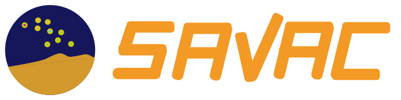
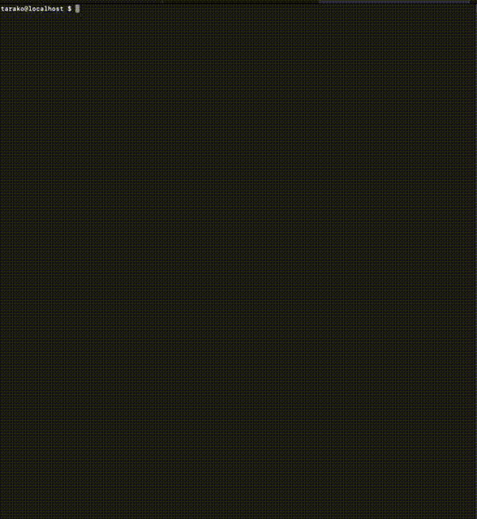

[](https://github.com/g1eng/SaVAC/actions/workflows/ci.yaml)
[](https://codecov.io/gh/g1eng/savac)

# これは何



SaVAC(Sakura VPS And Cloud utility)は「さくらのVPS」のAPIを通じた基盤操作をサポートする、非公式のCLIです。
「[さくらのVPS API (v5.0.0)](https://manual.sakura.ad.jp/vps/api/api-doc)」などを利用する、
サーバーやスイッチの操作、サーバー監視の設定をCLIで実施することができます。



このプロジェクトは、Sakura Internet IaaS ユーザーの切実な二ーズから出発しました。

* VPS APIやその他の新規APIエンドポイントをいち早く使いたい
* usacloudやクラウドSDKを用いたツールやスクリプトが用途別に散ってしまい管理しにくい
* AWS CLIやTerraformが導入できない環境でも、オブジェクトストレージやDNSを手早く操作したい

これらの課題を解決するため、`SaVAC`は「さくらのVPS」および「さくらのクラウド」に対する運用上有益な機能をシングルバイナリとして実現することに加えて、新規APIに対する実験的なサポートを提供しています。

各機能群に対する `SaVAC`プロジェクトのサポートポリシは[こちら](POLICY.md)をご覧ください。


# 実行環境

以下の環境での動作をサポートします。

* amd64 / aarch64 アーキテクチャのCPUを搭載するPC / Mac
* RAM 512MB以上
* ディスク空き容量 5MB以上
* 以下いずれかのOS 
  - Linux (kernel >= 5.x)
  - macOS Ventura 以降
  - Windows 10 以降
  - FreeBSD 12 以降 (amd64のみサポート)
* Go >= v1.24.1 (ご自身でビルドする場合のみ)


# インストール

### リリースバイナリをダウンロードする場合

リリースページからご所望のバージョン・ご所望のOSを対象とするパッケージをダウンロードし、展開したバイナリをPATHに置いてください。

Unix系OSでは、インストールスクリプトを利用できます。

```shell
curl -fSLO https://raw.githubusercontent.com/g1eng/savac/refs/heads/main/install.sh
sha256sum install.sh | grep -i 6f9e293cd17c5ea7249deb9c419516b501f678ca075e74934c17d4db6aa9c515 && PREFIX=$HOME sh < install.sh
```

### 自分でビルドする場合

```shell
$ go install github.com/g1eng/savac
```

### 認証情報について

#### VPS APIのアクセスキー

SaVACでさくらのVPS APIにアクセスするためには、アクセスキーの設定が必要です。
事前に「[さくらのVPS](https://vps.sakura.ad.jp)」の契約を取得し、新規のAPIキーを発行してください。

取得済みAPIキーは環境変数`SAKURA_VPS_API_SECRET`で指定することができます。
(非推奨オプションですが、`--api-secret`の引数によるAPIキーの指定も可能です。)

##### Unix系OS

```shell
export SAKURA_VPS_API_SECRET=xxxxxxxxxxxxxxxxxxxxxxxxxx
```

##### Windows

ダウンロードした`savac.exe`を`PATH`に設置した上で、環境変数を設定してください。

```powershell
[System.Environment]::SetEnvironmentVariable("SAKURA_VPS_API_SECRET", "XXXXXXXXXXXXX", "User")
```

※環境変数の値については、実際の値に置き換える必要があります。


その他の認証情報に関するTipsについては、[こちら](CREDENTIALS.md)をご覧下さい。


# 使い方

現行バージョンのSaVACがサポートする操作の一覧表については、[機能一覧](FEATURES.md)にまとめています。

基本的な使い方は[チュートリアル](https://g1eng.github.io/SaVAC/use_cases)をご覧ください。
クラウドリソースの操作方法については、[こちら](https://g1eng.github.io/SaVAC/advanced_use_cases)で説明しています。

## 制限事項

次のVPS API操作は未実装です。

* server: `cdrom`, `video-device`, `limitation`

# ライセンス

Apache 2.0


# Authors

Nomura Suzume <SuzuME[AT]ea.g1e.org>
